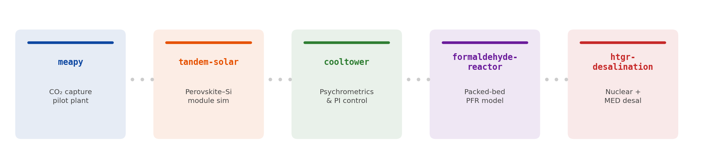
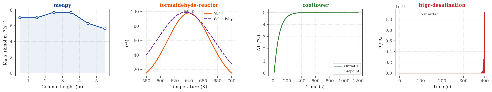

# Hi, I'm Defne 👋

I'm a Chemical Engineering student at Imperial College London building scientific Python tools for carbon capture, energy systems, process modelling, and thermal systems.

My work sits at the intersection of **carbon capture and pilot plant analysis**, **reactor and separation process modelling**, **solar and nuclear energy systems**, and **scientific software engineering**.

  

---

## Start here

### [`meapy`](https://github.com/defnalk/meapy)
Production-grade calculation engine for MEA-based post-combustion CO₂ capture. Implements LMTD and NTU-effectiveness methods for plate heat exchangers, K_OGa mass-transfer profiling along packed absorber columns, and pump commissioning via exponential/linear regression with constraint-based safe-speed determination. Zero magic numbers — every constant is sourced and cited.

### [`tandem-solar`](https://github.com/defnalk/tandem-solar)
Device-to-module simulator for perovskite–silicon tandem photovoltaics. Solves single-diode I–V equations across series/parallel terminal configurations, applies cell-to-module optical and resistive loss models, and simulates bypass diode activation under partial shading. Built for rapid parameter sweeps over module architectures.

### [`cooltower`](https://github.com/defnalk/cooltower)
Mechanical-draught cooling tower analysis library covering psychrometric state calculations (Buck 1981, Sprung), steady-flow energy and mass balances with back-calculated air flow rates, and FOPDT-based PI controller tuning (lambda/IMC, Ziegler–Nichols, Cohen–Coon). Includes closed-loop simulation with velocity-form anti-windup and ISE/IAE/ITAE scoring.

---

## Representative outputs

  

<b>Left to right:</b> KOGa mass-transfer profile along an MEA absorber column (<code>meapy</code>) · HCHO yield and selectivity vs. temperature for a packed-bed PFR (<code>formaldehyde-reactor</code>) · PI closed-loop step response with lambda tuning (<code>cooltower</code>) · Normalised reactor power transient from a reactivity insertion (<code>htgr-desalination</code>)

---

## What I care about in code

I like building software that is **physically grounded**, **well-tested**, **typed and readable**, and **useful beyond a single notebook or class project**.

---

## Technical stack

`Python` · `NumPy` · `SciPy` · `pandas` · `matplotlib` · `pytest` · `mypy` · `Ruff`

Scientific modelling · Process systems · Thermodynamics · Heat and mass transfer

---

## Selected repositories

| Repository | Description |
|---|---|
| [`meapy`](https://github.com/defnalk/meapy) | MEA carbon capture pilot-plant calculations |
| [`tandem-solar`](https://github.com/defnalk/tandem-solar) | Perovskite–silicon tandem module simulation |
| [`cooltower`](https://github.com/defnalk/cooltower) | Cooling tower psychrometrics and PI control |
| [`htgr-desalination`](https://github.com/defnalk/htgr-desalination) | HTGR point kinetics + MED desalination |
| [`formaldehyde-reactor`](https://github.com/defnalk/formaldehyde-reactor) | LHHW packed-bed PFR with Ergun pressure drop |
| [`sepflows`](https://github.com/defnalk/sepflows) | Composable separation-process building blocks |

---

## Currently interested in

Climate tech · Energy systems · Scientific software · Technical product work · Modelling · Research-driven engineering
